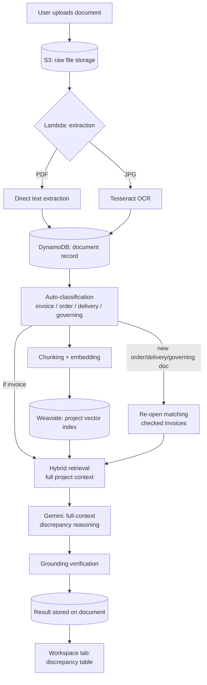

# Clarivo

**Agentic Accounts Payable System — an AI system that finds discrepancies in procurement documents, it investigates and resolves them, without Human Involvement.**

> Detection is a solved problem. Resolution isn't. Clarivo handles both for Commercial AP of Small to Medium Scale Businesses.

---

## Status

This repository implements the **Prototype-1** — a working, end-to-end vertical slice covering ingestion, extraction, semantic indexing, and LLM-driven discrepancy detection and auto-resolution for a single project workspace. It is built to prove a specific architectural thesis as a working prototype, where the upcoming features make it a final commercial product. 
See [Roadmap](#roadmap) for what's deliberately out of scope right now, and why.

---

## The Problem

Every procurement transaction generates a paper trail — a purchase order, a delivery note, an invoice, a payment record — and someone has to check that all four agree. In practice, they frequently don't: wrong rates, wrong quantities, duplicate bills arriving through different channels, invoices that simply never show up.

This isn't a small, solved corner of enterprise software. Despite two decades of accounts-payable automation investment, industry benchmarking puts **touchless invoice processing at roughly 32.6%** — meaning two-thirds of invoices still require a human to intervene — and **exception rates commonly exceed 22%**, cited as the largest remaining barrier to further automation. Manual processing costs an estimated **₹350–500 per invoice** once labor, storage, and error correction are counted. In India specifically, mismatches between a buyer's records and a supplier's GST filings can cause input tax credit to lapse permanently, with unclaimed credit estimated at around **3.5% of annual revenue** for affected companies.

The reason two decades of tooling hasn't closed this gap: existing systems are excellent at *matching* two documents and terrible at anything past that. When a match fails, they hand a human a queue entry and stop. They cannot investigate, cannot contact a supplier, and cannot read a free-text reply. That gap — not the matching itself — is what Clarivo is built to close.

## The Solution

Clarivo ingests procurement documents into a project workspace, extracts and classifies them, and — for every invoice — reasons over the *entire relevant context of that project* (related orders, delivery notes, governing rate agreements, other invoices) to decide, with cited evidence, whether it's clean, genuinely wrong, or explainable by evidence a naive one-to-one comparison would never have looked at.

Where a case resolves itself — for example, two partial deliveries that together account for an invoice's quantity — Clarivo closes it automatically, with a full evidence trail, and never surfaces it to a human at all.

## Key Features

- **Multi-format ingestion** — PDF and scanned/photographed image uploads into a per-project workspace
- **Dual extraction pipeline** — direct text extraction for digital PDFs, Tesseract OCR for photographed documents, unified into one downstream representation
- **Automatic document classification** — every document is tagged (invoice / order / delivery / governing / other) without user input, determining what gets actively checked versus what serves as reference context
- **Semantic project indexing** — every document is chunked and embedded into a per-project vector index, queryable by hybrid (keyword + vector) search
- **Full-context LLM reasoning** — each invoice is checked against its entire project's relevant context in one reasoning pass, not a brittle field-by-field comparison
- **Evidence grounding verification** — every cited claim is checked against source text before being trusted; unverified citations are surfaced, not hidden
- **Autonomous resolution** — cases explainable by available evidence close themselves, with a full, auditable evidence trail
- **Incremental re-evaluation** — a newly uploaded document automatically re-opens any previously-checked case it's relevant to, rather than requiring a manual re-check
- **Touchless-rate reporting** — the percentage of documents resolved without human review is a first-class, always-visible metric, not an afterthought

## Architecture



New evidence doesn't just sit in the index — classifying an order, delivery, or governing document as such automatically re-opens any already-checked invoice it might be relevant to, so a case resolved yesterday can genuinely change today.

## Tech Stack

| Layer | Choice | Why |
|---|---|---|
| Backend framework | Django + Django REST Framework | Built-in auth, ORM, and admin reduce the number of decisions a small team has to get right independently |
| Backend datastore | SQLite | Users, auth, and project metadata only — deliberately not used for document data |
| Document store | AWS DynamoDB | Semi-structured document/claim records, keyed by project and document ID, on-demand billing |
| File storage | AWS S3 | Raw uploaded files, accessed via short-lived presigned URLs, never public |
| Extraction compute | AWS Lambda (container image) | Dual extraction paths (direct + OCR) in one deployable unit; container image chosen specifically because Tesseract packaging in a standard zip-based Lambda is unreliable |
| Vector database | Weaviate Cloud | Hybrid (keyword + vector) search, self-provided embeddings |
| Embedding model | `fastembed` | Lightweight, ONNX-based — avoids the PyTorch dependency weight of alternatives, keeps ingestion-time compute cheap |
| LLM | Gemini 2.5 Flash | Full 1M-token context window on a genuine free tier — evaluated directly against paid-only alternatives before selection |
| Frontend framework | React + Vite | Fast local dev loop |
| Styling | Tailwind CSS | Utility-first, no separate design system to maintain for a prototype at this stage |
| Markdown rendering | `react-markdown` + `remark-gfm` | GitHub-flavored table support for the discrepancy view |
| Auth | DRF Token Authentication | Single-tenant prototype scope — see Roadmap for multi-user plans |

## Project Structure

```
Clarivo/
├── Backend-Clarivo/
│   ├── clarivo_backend/        # Django project settings
│   ├── accounts/                # Authentication
│   ├── projects/                 # Project (workspace) model and endpoints
│   ├── documents/                 # Upload, extraction status, embedding pipeline
│   ├── detection/                   # Classification, retrieval, LLM reasoning, grounding checks
│   ├── lambda_functions/
│   │   └── extraction/               # Containerized Lambda: PDF + OCR extraction
│   ├── .antigravity-rules
│   └── requirements.txt
└── Frontend-Clarivo/
    └── src/
        ├── pages/                    # Login, ProjectList
        ├── api/                       # API client configuration
        └── workspace/
            ├── FilesTab/                # Upload + document list
            └── WorkspaceTab/              # Discrepancy table, evidence, summary
```

## Getting Started

**Prerequisites:** Python 3.12+, Node.js, Docker, an AWS account, a Weaviate Cloud sandbox, a Gemini API key from Google AI Studio.

**Backend:**
```bash
cd Backend-Clarivo
python -m venv venv && source venv/bin/activate
pip install -r requirements.txt
cp .env.example .env   # fill in AWS, DynamoDB, S3, Weaviate, and Gemini credentials
python manage.py migrate
python manage.py createsuperuser
python manage.py runserver
```

**Frontend:**
```bash
cd Frontend-Clarivo
npm install
cp .env.example .env   # set VITE_API_BASE_URL
npm run dev
```

**Extraction Lambda** (deployed separately, not via the Django dev server):
```bash
cd Backend-Clarivo/lambda_functions/extraction
docker build -t clarivo-extraction .
# tag, push to ECR, and deploy — see the environment setup notes in this folder
```

Full step-by-step environment setup (AWS resource creation, IAM permissions, Lambda deployment) is documented in this project's internal build guides, not duplicated here to avoid drift between two copies of the same instructions.

## API Reference

| Endpoint | Method | Purpose |
|---|---|---|
| `/api/auth/login/` | POST | Authenticate, returns a token |
| `/api/projects/` | GET / POST | List or create project workspaces |
| `/api/projects/:id/documents/presign/` | POST | Get a presigned S3 upload URL |
| `/api/projects/:id/documents/confirm/` | POST | Confirm an upload, create the document record |
| `/api/projects/:id/documents/` | GET | List a project's documents with status and view links |
| `/api/projects/:id/documents/:doc_id/embed/` | POST | Chunk and index a document into Weaviate |
| `/api/projects/:id/documents/:doc_id/classify/` | POST | Classify a document's type |
| `/api/projects/:id/check/` | POST | Run detection across all eligible invoices in a project |
| `/api/projects/:id/discrepancy-table/` | GET | Fetch the current discrepancy table and summary metrics |

## Design Principles

- **The LLM decides; code verifies.** Discrepancy judgments are made by the model, given full context — but every cited claim is checked against source text before being trusted. Neither pure rule-matching nor blind trust in model output was acceptable; this project deliberately picked the harder middle path.
- **Include everything the model can actually use.** At this project's document scale, artificially truncating retrieved context to a small top-K would risk missing the exact evidence needed to resolve a case — the entire architecture is built around giving the model full relevant context rather than a fragile guess at relevance.
- **Automate eligibility, not just execution.** Which documents even get checked is itself an automatic classification, not a manual selection step or a second speculative judgment call — the system decides what needs checking the same way it decides what's wrong with it.
- **Evidence over confidence.** A finding without a checkable citation is treated as less trustworthy, not more, regardless of how fluent the explanation reads.

## Roadmap

Deliberately out of scope for the current prototype, planned for subsequent iterations:

- Live Gmail ingestion (OAuth-connected inbox watching, not just manual upload)
- WhatsApp Business API ingestion for photographed supplier bills
- Automated supplier correspondence — the system drafting and sending clarification emails, then parsing free-text replies
- An interactive AI chat surface scoped to individual documents
- Missing-invoice detection via expectation timers (catching a bill that never arrives, not just one that's wrong)
- Multi-month price-drift detection across recurring supplier relationships
- Multi-tenant support (the current prototype is intentionally single-user)

## Evaluation Approach

Rather than relying on real company data — impractical to obtain and inappropriate to use for a public repository — this project evaluates against a hand-authored synthetic dataset with deliberately planted discrepancies of known type and location, allowing precise measurement of detection recall, false-positive rate, and the touchless-resolution rate the system reports at runtime. This approach is documented in this project's internal planning materials.

## License

MIT — see [LICENSE](./LICENSE).