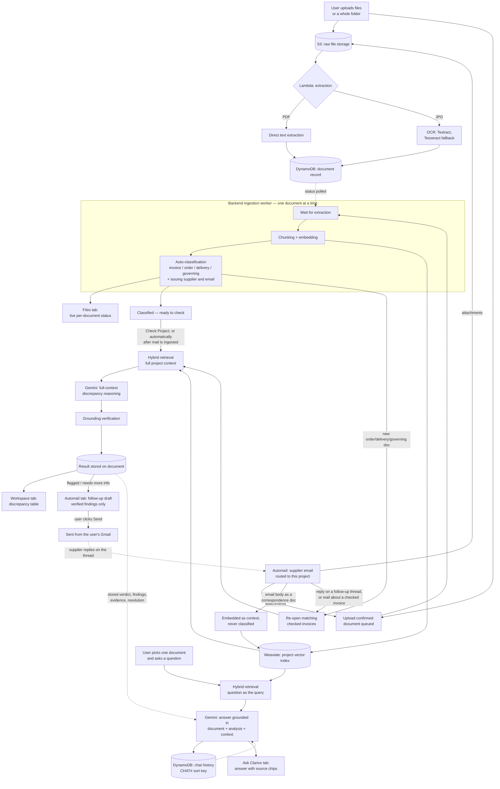
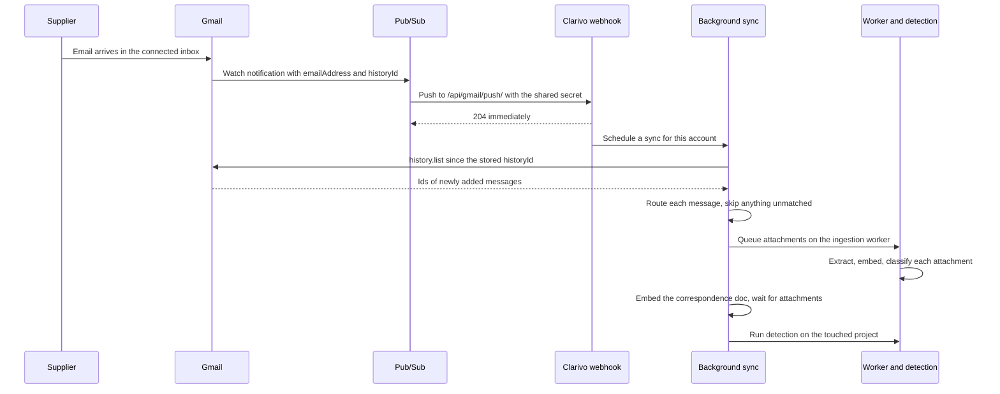
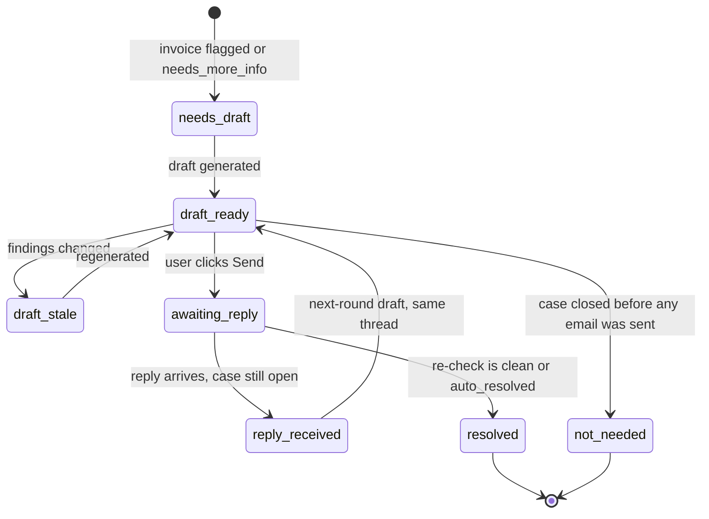

# Clarivo

**Agentic Accounts Payable System — an AI system that finds discrepancies in procurement documents, it investigates and resolves them, without Human Involvement.**

> Detection is a solved problem. Resolution isn't. Clarivo handles both for Commercial AP of Small to Medium Scale Businesses.

---

## Status

This repository implements the **Prototype-1** — a working, end-to-end vertical slice for a single project workspace. It covers:

- ingestion and extraction
- semantic indexing
- LLM-driven discrepancy detection and auto-resolution
- a document-scoped chat surface that explains those results
- **Automail**, an email agent. It brings supplier mail from a connected Gmail inbox into the right project, and follows up with the supplier on any case the documents alone can't close.

It is built to prove a specific architectural thesis as a working prototype, where the upcoming features make it a final commercial product.
See [Roadmap](#roadmap) for what's deliberately out of scope right now, and why.

---

## The Problem

Every procurement transaction generates a paper trail — a purchase order, a delivery note, an invoice, a payment record — and someone has to check that all four agree. In practice, they frequently don't: wrong rates, wrong quantities, duplicate bills arriving through different channels, invoices that simply never show up.

This isn't a small, solved corner of enterprise software. Despite two decades of accounts-payable automation investment, industry benchmarking puts **touchless invoice processing at roughly 32.6%** — meaning two-thirds of invoices still require a human to intervene — and **exception rates commonly exceed 22%**, cited as the largest remaining barrier to further automation. Manual processing costs an estimated **₹350–500 per invoice** once labor, storage, and error correction are counted. In India specifically, mismatches between a buyer's records and a supplier's GST filings can cause input tax credit to lapse permanently, with unclaimed credit estimated at around **3.5% of annual revenue** for affected companies.

The reason two decades of tooling hasn't closed this gap: existing systems are excellent at *matching* two documents and terrible at anything past that. When a match fails, they hand a human a queue entry and stop. They cannot investigate, cannot contact a supplier, and cannot read a free-text reply. That gap — not the matching itself — is what Clarivo is built to close.

## The Solution

Clarivo ingests procurement documents into a project workspace, extracts and classifies them, and — for every invoice — reasons over the *entire relevant context of that project* (related orders, delivery notes, governing rate agreements, other invoices) to decide, with cited evidence, whether it's clean, genuinely wrong, or explainable by evidence a naive one-to-one comparison would never have looked at.

Where a case resolves itself — for example, two partial deliveries that together account for an invoice's quantity — Clarivo closes it automatically, with a full evidence trail, and never surfaces it to a human at all.

Some cases can't be closed from the documents at hand: a rate that matches no agreement, or a quantity no delivery note accounts for. For these, Clarivo goes to the supplier:

1. It drafts a specific follow-up email that cites the evidence.
2. The user sends it from their own Gmail.
3. The supplier's reply comes back into the project as new evidence.
4. Clarivo re-checks the invoice.

A reply is treated as a claim to verify, not an answer to believe. A supplier who concedes the buyer's figure closes the case, because the buyer's own documents already prove that answer. An explanation in the supplier's favour with no document behind it gets a request for that document, not a closed case. The one step Clarivo deliberately leaves to a person is pressing **Send**.

## Key Features

- **Multi-format ingestion** — PDF and scanned or photographed image uploads into a per-project workspace. Upload one file at a time, a multi-file selection, or a whole folder, which is ingested recursively through every nested subdirectory. Files also arrive by email: every PDF and JPG attached to supplier mail routed to the project is ingested automatically, with no upload step
- **Hands-off ingestion pipeline** — a single upload carries itself from S3 through extraction, indexing, and classification with no further interaction. The browser watches progress rather than driving it
- **Dual extraction pipeline** — direct text extraction for digital PDFs (`pypdf`), and OCR for photographed documents — AWS Textract, falling back to Tesseract — unified into one downstream representation
- **Automatic document classification** — every document is tagged (invoice / order / delivery / governing / other) without user input. The tag decides what gets actively checked and what serves as reference context. The same model call records the business that *issued* the document, and any email address printed for it
- **Semantic project indexing** — every document is chunked and embedded into a per-project vector index, queryable by hybrid (keyword + vector) search
- **Full-context LLM reasoning** — each invoice is checked against its project's entire relevant context in one reasoning pass, not a brittle field-by-field comparison
- **Evidence grounding verification** — every cited claim is checked against source text before it's trusted. Unverified citations are surfaced, not hidden
- **Autonomous resolution** — cases explainable by available evidence close themselves, with a full, auditable evidence trail
- **Incremental re-evaluation** — a newly uploaded document automatically re-opens any previously checked case it's relevant to, rather than requiring a manual re-check
- **Touchless-rate reporting** — the percentage of documents resolved without human review is a first-class, always-visible metric, not an afterthought
- **Ask Clarivo — document-scoped chat** — pick any document and ask about it in plain language. The assistant answers from that document, its project context and, crucially, *Clarivo's own stored analysis of it*. So asking "why was this flagged?" explains the verdict already on the record, rather than improvising a second opinion
- **Complete project deletion** — deleting a project clears its files from S3, its records from DynamoDB and its chunks from Weaviate before the project row itself goes, so nothing is left orphaned in a store that no longer has anything pointing at it

### Automail — the supplier email agent

- **Least-privilege Gmail connection** — OAuth 2.0 with exactly two scopes, read and send. Clarivo holds nothing that could delete, label or modify the inbox. Refresh tokens are encrypted at rest
- **Push-driven inbox watching** — a Gmail watch publishes to Google Cloud Pub/Sub, which pushes to a Clarivo webhook as soon as mail arrives. Where Pub/Sub isn't available, a polling mode runs the identical sync on a timer
- **Project routing, or nothing** — each new email is routed to a project by one of three signals:
  - its Gmail thread
  - the project's name in the subject or body
  - a sender who is a known supplier of exactly one project

  Mail that matches none of these is skipped and never stored
- **Emails become evidence** — a routed email's PDF and JPG attachments go through the same S3 → Lambda → ingestion-worker pipeline as an upload: stored in S3, queued on the same worker, then extracted, indexed and classified exactly like a file dropped into the Files tab, where they appear tagged *via email*. The email body becomes a *correspondence* document: indexed as project context, never classified, never checked as an invoice
- **Claims, not proof** — detection treats correspondence as statements made by a person, and weighs each by which way it cuts. A supplier who *concedes* — accepting the order's rate or the delivered quantity, or withdrawing a duplicate — closes the case, because the buyer's own records already back that answer. A supplier who *justifies* the invoice as billed resolves the case only when a real document corroborates it. Otherwise the invoice moves to `needs_more_info`, and the missing document is named. A vague "it's been sorted" resolves nothing
- **Auto-drafted follow-ups** — every flagged or `needs_more_info` invoice is listed for follow-up, and opening it drafts the email:
  - a recipient
  - a subject naming the project and the issue
  - a body that cites the exact figures and the documents they came from

  A draft is generated once and stored. It is regenerated only on request. If the case underneath it changes, the draft is marked out of date and a regenerate is offered, with a confirmation first if the user has edited it
- **Verified facts only** — a finding goes into an email only if its evidence passed grounding verification. Findings that failed are listed for the user and never sent to the supplier
- **A human sends every email** — sending is an explicit, confirmed click, from the user's own address. Clarivo never emails anyone on its own
- **Multi-round threads** — follow-ups reply in the same Gmail thread with correct reply headers, so a dispute that takes three rounds reads as one conversation on both sides
- **Supplier contact learning** — supplier addresses are learned from three sources: the documents themselves, the address that actually sent the invoice, and whatever the user types. A fixed trust order means an address read off a letterhead never overwrites a typed or real-sender one
- **Mail-triggered re-evaluation** — a supplier's reply on a follow-up thread re-opens that exact invoice. Other routed mail re-opens the checked invoices it bears on: every invoice of a known sender's supplier, any invoice whose supplier or reference number the email names, and — when nothing identifies the email — the project's open cases. Each is re-checked with the email and its attachments in context, so a case can close itself without anyone clicking Check Project
- **A Gmail-style project inbox** — matched threads, newest first. Each thread is tagged with why it was routed to this project. Attachments show their processing status inline, updating live, and open from S3 in a new tab — the same presigned link the Files tab uses

## Architecture


```mermaid
flowchart TD
    A[User uploads files\nor a whole folder] --> B[(S3: raw file storage)]
    A --> Q[Upload confirmed:\ndocument queued]
    G[Automail: supplier email\nrouted to this project] -->|attachments| B
    G -->|attachments| Q
    G -->|email body as a\ncorrespondence doc| CD[Embedded as context,\nnever classified]
    CD --> I
    B --> C{Lambda: extraction}
    C -->|PDF| D[Direct text extraction]
    C -->|JPG| E[OCR: Textract,\nTesseract fallback]
    D --> F[(DynamoDB: document record)]
    E --> F

    Q --> W1

    subgraph W [Backend ingestion worker — one document at a time]
        direction TB
        W1[Wait for extraction] --> W2[Chunking + embedding]
        W2 --> W3[Auto-classification\ninvoice / order / delivery / governing\n+ issuing supplier and email]
    end

    F -.->|status polled| W1
    W2 --> I[(Weaviate: project vector index)]
    W3 --> P[Files tab:\nlive per-document status]

    W3 --> R[Classified — ready to check]
    R -->|Check Project, or automatically\nafter mail is ingested| J[Hybrid retrieval\nfull project context]
    I --> J
    J --> K[Gemini: full-context\ndiscrepancy reasoning]
    K --> L[Grounding verification]
    L --> M[(Result stored on document)]
    M --> N[Workspace tab:\ndiscrepancy table]
    W3 -->|new order/delivery/governing doc| O[Re-open matching\nchecked invoices]
    G -->|reply on a follow-up thread,\nor mail about a checked invoice| O
    O --> J

    M -->|flagged / needs more info| FD[Automail tab: follow-up draft\nverified findings only]
    FD -->|user clicks Send| SG[Sent from the user's Gmail]
    SG -.->|supplier replies on the thread| G

    U[User picks one document\nand asks a question] --> V[Hybrid retrieval\nquestion as the query]
    I --> V
    M -.->|stored verdict, findings,\nevidence, resolution| X
    V --> X[Gemini: answer grounded in\ndocument + analysis + context]
    Y[(DynamoDB: chat history\nCHAT# sort key)] -.-> X
    X --> Y
    X --> Z[Ask Clarivo tab:\nanswer with source chips]
```

Ingestion is owned by the backend, not the browser. Confirming an upload queues the document on a single background worker. The worker waits for extraction to land, then indexes and classifies the document, so it finishes its journey whether or not the tab that uploaded it is still open. The frontend polls only to display progress, and stops once every document has settled. Because the worker processes one document at a time, a folder of fifty files queues up behind itself rather than firing fifty simultaneous model calls.

New evidence doesn't just sit in the index. Classifying an order, delivery, or governing document automatically re-opens any already-checked invoice it might be relevant to, so a case resolved yesterday can genuinely change today.

Chat reads from the same index but not in the same way. Detection embeds a whole invoice and deliberately *excludes* that invoice from retrieval, because including it would only return the claims it is trying to verify. Chat embeds the user's question and deliberately *includes* the selected document, because that is the thing being asked about. The two therefore run separate retrieval paths rather than sharing one with a flag.

Mail enters the same pipeline, not a parallel one. An emailed attachment is uploaded to the same S3 key layout as a browser upload, extracted by the same Lambda, and queued on the same worker, through the same `enqueue_document` call the upload confirm endpoint makes. A mail-triggered batch waits until every emailed attachment has been classified, then ends with an automatic detection run on the affected project, because nobody is sitting at the Workspace tab to click Check Project when a supplier replies. The wait matters: an invoice re-checked a moment before the delivery note that came with the email was indexed would be judged without it.

### Automail

#### How a supplier email reaches a verdict


```mermaid
sequenceDiagram
    participant S as Supplier
    participant GM as Gmail
    participant PS as Pub/Sub
    participant WH as Clarivo webhook
    participant BG as Background sync
    participant PL as Worker and detection
    S->>GM: Email arrives in the connected inbox
    GM->>PS: Watch notification with emailAddress and historyId
    PS->>WH: Push to /api/gmail/push/ with the shared secret
    WH-->>PS: 204 immediately
    WH->>BG: Schedule a sync for this account
    BG->>GM: history.list since the stored historyId
    GM-->>BG: Ids of newly added messages
    BG->>BG: Route each message, skip anything unmatched
    BG->>PL: Queue attachments on the ingestion worker
    PL->>PL: Extract, embed, classify each attachment
    BG->>BG: Embed the correspondence doc, wait for attachments
    BG->>PL: Run detection on the touched project
```

**A notification is a hint, not data.** A Pub/Sub message carries only the mailbox address and a history id. It says that something changed, not what. All the real work happens in one function, `sync_mailbox`, which reads Gmail's history since the last stored history id. Three triggers call it:

- the push webhook
- the **Sync now** button
- polling mode, every 60 seconds while the Automail tab is open

Because all three share one function, they can never disagree about what was ingested. Gmail history ids are typically valid for about a week. If the stored one has aged out, the sync falls back to listing the last few days of inbox mail, then resets its starting point.

**Acknowledge first, work later.** Pub/Sub retries any push that isn't acknowledged within its deadline. So the webhook does only three things:

1. checks the shared secret
2. hands the account to a background thread
3. returns `204`, within milliseconds

Only one sync runs per account at a time. A notification that lands mid-sync marks the account dirty, and the running sync loops once more instead of starting a second one. The thread is the prototype's stand-in for a durable queue (see [Roadmap](#roadmap)).

**Idempotent by construction.** Gmail notifications can arrive late, twice, or out of order. Every email record is written with a DynamoDB conditional put keyed on Gmail's message id, so the first write wins and every duplicate is a no-op. Replaying a notification, or a push racing a manual sync, can never ingest the same email twice. The same pattern guards detection: an invoice is claimed with a conditional status transition before it's analysed, so a mail-triggered run and a manual Check Project can never analyse the same invoice at once.

**The Gmail watch is kept alive.** A Gmail watch expires after seven days without warning. Clarivo renews it whenever fewer than 48 hours remain, checking each time the connection status is read or a sync runs.

#### Routing: which project does this email belong to?

Each inbound email is tested against three signals in order, and the first match wins:

| Order | Signal | Why it ranks here |
|---|---|---|
| 1 | The Gmail thread is already linked to a project | Replies to Clarivo's own follow-ups are the most common inbound mail. They route with certainty, even if the supplier rewrote the subject line |
| 2 | A project name (5+ characters) appears in the subject or body | An explicit mention. When several names match, the longest wins, so a more specific project name beats a shorter one it contains |
| 3 | The sender is a known supplier contact of **exactly one** project | A supplier active on two projects is ambiguous, so the email is skipped rather than guessed |

Candidate projects are only ever the connected user's own. The user's own outgoing mail is ignored. An email that matches nothing leaves no record anywhere: no email item, no document, no log line containing its content.

#### What a routed email becomes

| Part of the email | Becomes | Treatment |
|---|---|---|
| The message itself | An `EMAIL#` record | Powers the project inbox view. Written once, keyed on Gmail's message id |
| The body | A `correspondence` document | Quoted reply history is stripped, so each message's text is stored once. Embedded as project context, labelled **SUPPLIER CORRESPONDENCE** whenever it enters a detection prompt, never classified, never checked |
| Each PDF / JPG attachment | A normal document | Same S3 key layout, same Lambda, same worker as a browser upload, tagged as having arrived by email |

The body is deliberately not treated as a normal document. An email saying "attached is our invoice for ₹24,662" would, if classified, become a second invoice and get flagged as a duplicate of its own attachment.

Attachments are filtered and staged carefully:

- **Filtered.** Only PDF and JPG attachments are taken — the types the extraction Lambda reads, and the same set the Files tab accepts. Images embedded in the email body (signature logos, mostly) and images under 15 KB are skipped. A PDF is never treated as embedded, and a `Content-ID` header alone doesn't make a file embedded: Gmail puts one on every attachment.
- **Filenames are sanitised.** S3 event keys arrive URL-encoded, and a space in a filename would break the Lambda's key parsing.
- **The record is written before the upload.** The upload is what triggers extraction. A Lambda that finished first would otherwise have its extracted text overwritten by a late placeholder write.

#### Follow-up lifecycle


```mermaid
stateDiagram-v2
    [*] --> needs_draft: invoice flagged or needs_more_info
    needs_draft --> draft_ready: draft generated
    draft_ready --> draft_stale: findings changed
    draft_stale --> draft_ready: regenerated
    draft_ready --> awaiting_reply: user clicks Send
    awaiting_reply --> reply_received: reply arrives, case still open
    reply_received --> draft_ready: next-round draft, same thread
    awaiting_reply --> resolved: re-check is clean or auto_resolved
    draft_ready --> not_needed: case closed before any email was sent
    resolved --> [*]
    not_needed --> [*]
```

`not_needed` means no email ever went out. A case that closes after any round was sent is `resolved`, even if a later-round draft was still unsent at the time.

**Drafts are stored, not regenerated per visit.** A draft is written the first time its invoice is opened in the Follow-ups list, and again only when a supplier's reply opens a new round. Re-opening it never burns another model call or wipes the user's edits. A draft carries a fingerprint of the findings it was written from. If detection later changes those findings, the draft is marked out of date and offered for regeneration rather than silently rewritten. A draft the user has edited is never regenerated without confirmation.

**A draft is built from verified findings only.** The model receives just the findings whose evidence passed grounding verification, with their exact figures and source documents. It is told to use only those facts, never invent references, assume an honest error, and stay under 200 words. If nothing verifiable is left, the draft becomes a polite request to confirm the invoice's details instead of a dispute.

**The recipient is resolved in trust order.** Clarivo looks for an address in this order:

1. one the user typed
2. the address that actually emailed the supplier's documents
3. one printed on the documents

If none exists, the field is left empty for the user, and whatever they type is remembered for next time.

**Later rounds stay in one conversation.** After a send, the thread is linked to that invoice, which is what routes the supplier's reply straight back to it. A round-2 draft answers what the supplier actually said: if they made a claim without documentation, it thanks them and asks for the specific document that would confirm it. It goes out as a reply in the same thread, with a matching `Re:` subject and proper reply headers, so both mailboxes show one conversation.

**Clarivo never cites itself.** Outbound follow-ups are stored so the inbox reads like Gmail, but they are never embedded. If Clarivo's own email entered the detection context, the detector could cite Clarivo's assertions as evidence, and the grounding check would pass on text Clarivo wrote.

#### Security and privacy

| Concern | Handling |
|---|---|
| Scope of access | Only `gmail.readonly` and `gmail.send` — no modify, label or delete capability exists to misuse |
| Stored credentials | Refresh tokens are Fernet-encrypted at rest and excluded from the Django admin |
| OAuth redirect | State is random, stored server-side, single-use, and expires after 10 minutes. The callback takes the user's identity only from that stored state, never from the URL |
| Public webhook | Pub/Sub can't send a DRF token, so the endpoint is gated by a shared secret compared in constant time. It does nothing except schedule a sync |
| Hostile email content | Email bodies are rendered as plain text, never as HTML, so a crafted email can't inject markup or script into the app |
| Unrelated mail | Never persisted, in any store |
| Historical mail | Not read. Only mail arriving after the connection is made is ingested |
| Disconnecting | Stops the watch and revokes the token at Google. Mail already ingested stays as project data |

## Tech Stack

| Layer | Choice | Why |
|---|---|---|
| Backend framework | Django + Django REST Framework | Built-in auth, ORM, and admin reduce the number of decisions a small team has to get right independently |
| Backend datastore | SQLite | Users, auth, project metadata and Gmail connection state only — deliberately not used for document or email data |
| Document store | AWS DynamoDB | Semi-structured document, claim, email and draft records, keyed by project and ID, on-demand billing |
| File storage | AWS S3 | Raw uploaded and emailed files, accessed via short-lived presigned URLs, never public |
| Extraction compute | AWS Lambda (container image) | Dual extraction paths in one deployable unit: `pypdf` for digital PDFs, and AWS Textract for images with a bundled Tesseract fallback. A container image was chosen specifically because Tesseract packaging in a standard zip-based Lambda is unreliable |
| Vector database | Weaviate Cloud | Hybrid (keyword + vector) search, self-provided embeddings |
| Embedding model | `fastembed` | Lightweight and ONNX-based — avoids the PyTorch dependency weight of alternatives and keeps ingestion-time compute cheap |
| LLM | Gemini 3.5 Flash-Lite (`google-genai`) | One model for classification, detection, chat and follow-up drafting. A long context window on a free tier — detection hands it up to ~200k tokens of project context per invoice |
| Mail provider | Gmail API (`google-api-python-client`) | History-based incremental sync, thread-aware sending, and a first-party push mechanism |
| Mail notifications | Google Cloud Pub/Sub (push subscription) | Gmail's own notification channel. Instant delivery, and at this volume it stays inside the free tier |
| Mail OAuth | `google-auth-oauthlib` (web flow, offline access) | Long-lived refresh tokens, so the inbox can be watched and synced with no browser open |
| Token encryption | `cryptography` (Fernet) | Symmetric, authenticated encryption for refresh tokens at rest, with a single key held in the environment |
| Email parsing | `beautifulsoup4` | HTML-only emails are converted to text before storage and embedding |
| Local push tunnel | ngrok (development only) | Pub/Sub only pushes to public HTTPS. A static free domain means the subscription endpoint is set once |
| Frontend framework | React + Vite | Fast local dev loop |
| Styling | Tailwind CSS | Utility-first, no separate design system to maintain for a prototype at this stage |
| Markdown rendering | `react-markdown` + `remark-gfm` | GitHub-flavored table support for the discrepancy view and for chat answers that compare values across documents |
| Auth | DRF Token Authentication | Single-tenant prototype scope — see Roadmap for multi-user plans |

## Project Structure

```
Clarivo/
├── GEMINI.md                     # Project rules for AI coding assistants
├── Backend-Clarivo/
│   ├── clarivo_backend/        # Django project settings
│   ├── accounts/                # Authentication
│   ├── projects/                 # Project (workspace) model, endpoints, cross-store cleanup
│   ├── documents/                 # Upload, background ingestion worker, embedding
│   ├── detection/                   # Classification, retrieval, LLM reasoning, grounding checks
│   ├── chat/                          # Ask Clarivo: history, retrieval, prompt, answering engine
│   ├── mail/                            # Automail: Gmail OAuth, push sync, routing, ingestion, follow-ups
│   ├── lambda_functions/
│   │   └── extraction/               # Containerized Lambda: PDF + OCR extraction
│   └── requirements.txt
└── Frontend-Clarivo/
    └── src/
        ├── pages/                    # Landing, Login, ProjectHome, ProjectWorkspace
        ├── layouts/                   # ProjectsLayout, the shell around the project pages
        ├── components/                # Shared UI (Logo)
        ├── api/                       # API client configuration
        └── workspace/
            ├── FilesTab/                # File/folder upload, live ingestion status
            ├── WorkspaceTab/              # Discrepancy table, evidence, summary
            ├── ChatPanel/                   # Ask Clarivo: document picker, thread, sources
            └── AutomailTab/                   # Gmail connection, project inbox, follow-up drafts
```

Inside `chat/`, the split is by responsibility rather than by Django convention: `storage.py` owns chat persistence in DynamoDB, `retrieval.py` owns question-driven hybrid search, `prompts.py` holds the system prompt, and `engine.py` assembles the four prompt inputs and calls the model. `views.py` stays thin.

`mail/` follows the same rule:

| File | Owns |
|---|---|
| `models.py` | `GmailAccount` (one per user, encrypted token, history id, watch expiry) and `OAuthState` |
| `crypto.py` | Token encryption and decryption |
| `gmail_client.py` | Credentials, token refresh, and the watch lifecycle (start, renew, stop) |
| `parsing.py` | MIME to text, attachment discovery, quoted-reply stripping |
| `storage.py` | `EMAIL#`, `THREAD#`, `CONTACT#` and `DRAFT#` persistence |
| `routing.py` | The three-signal project routing |
| `ingest.py` | One message in, its records and documents out |
| `sync.py` | History-based mailbox sync |
| `background.py` | The per-account sync thread and contact learning |
| `followups.py` | Follow-up state, draft generation and sending |
| `prompts.py` | The follow-up drafting prompt |

`views.py` stays thin here too.

On the frontend, `AutomailTab/` holds the tab shell, `AutomailTab` (the connection bar above **Inbox** and **Follow-ups** sub-tabs), and four components:

- `GmailConnectionBar` — connect, reconnect, sync, disconnect, and the push/polling mode label
- `InboxView` — the two-pane, Gmail-style thread reader; attachments open from S3
- `FollowupsView` — one row per invoice with its follow-up state
- `FollowupEditor` — the draft itself: To, Subject, Body, with **Send** in the bottom-right corner

## Getting Started

**Prerequisites:** Python 3.12+, Node.js, Docker, an AWS account, a Weaviate Cloud sandbox, a Gemini API key from Google AI Studio. For Automail you also need:

- a Google Cloud project
- an ngrok account, for receiving push notifications during local development
- a billing account linked to the Google Cloud project, but only if you use push mode (Pub/Sub requires one)

**Backend:**
```bash
cd Backend-Clarivo
python -m venv venv && source venv/bin/activate
pip install -r requirements.txt
cp .env.example .env   # fill in AWS, DynamoDB, S3, Weaviate, Gemini, and Google OAuth / Gmail values
python manage.py migrate
python manage.py createsuperuser
python manage.py runserver
```

**Frontend:**
```bash
cd Frontend-Clarivo
npm install
cp .env.example .env   # set VITE_API_BASE_URL
npm run dev
```

**Extraction Lambda** (deployed separately, not via the Django dev server):
```bash
cd Backend-Clarivo/lambda_functions/extraction
docker build -t clarivo-extraction .
# tag, push to ECR, and deploy — see the internal build guides noted below
```

**Automail (Gmail):**

1. **Google Cloud project.** Enable the **Gmail API** and the **Cloud Pub/Sub API**. Pub/Sub requires a billing account linked to the project even though Gmail notification traffic stays well inside its free tier. Without one, skip steps 3–4 and run in polling mode.
2. **OAuth consent screen and client** (Google Auth Platform):
   - User type External, publishing status Testing.
   - Add every Gmail account you'll connect as a **test user**.
   - Add the scopes `gmail.readonly` and `gmail.send`.
   - Create a **Web application** client with the authorised redirect URI `http://localhost:8000/api/gmail/oauth/callback/`.
3. **Pub/Sub topic.** Create a topic, then grant `gmail-api-push@system.gserviceaccount.com` the **Pub/Sub Publisher** role on it. Without this grant, creating the watch still succeeds, but no notification is ever delivered.
4. **Public HTTPS for local development.** Claim a static ngrok domain and run:
   ```
   ngrok http --url=<your-domain>.ngrok-free.app 8000
   ```
   Then create a **push** subscription on the topic:
   - endpoint `https://<your-domain>.ngrok-free.app/api/gmail/push/?token=<GMAIL_PUSH_SECRET>`
   - a 60-second acknowledgement deadline
   - exponential-backoff retries
5. **Secrets.** Generate the encryption key and the webhook secret:
   ```
   python -c "from cryptography.fernet import Fernet; print(Fernet.generate_key().decode())"
   python -c "import secrets; print(secrets.token_urlsafe(32))"
   ```
6. **Environment variables** (add them to `.env`, and the same keys with empty values to `.env.example`):

   | Variable | Purpose |
   |---|---|
   | `GOOGLE_CLIENT_ID`, `GOOGLE_CLIENT_SECRET` | The OAuth web client |
   | `GOOGLE_OAUTH_REDIRECT_URI` | Must exactly match the client's authorised redirect URI |
   | `GMAIL_PUBSUB_TOPIC` | `projects/<gcp-project-id>/topics/<topic-name>` |
   | `GMAIL_PUSH_ENABLED` | `True` for push mode, `False` for polling mode |
   | `GMAIL_PUSH_SECRET` | The shared secret carried in the push endpoint's URL |
   | `FIELD_ENCRYPTION_KEY` | The Fernet key that encrypts refresh tokens |
   | `FRONTEND_URL` | Where the OAuth callback redirects the browser afterwards |
   | `PUBLIC_HOSTNAME` | The tunnel or deployment host, added to `ALLOWED_HOSTS` so Django accepts Google's webhook calls |

7. **Projects created before Automail.** Their documents were classified before supplier email extraction existed. Backfill them without re-classifying:
   ```
   python manage.py backfill_supplier_emails <project_id>
   ```
   Re-classifying would trigger incremental re-evaluation and re-open every checked invoice in the project.
8. **Connect.** Open a project → **Automail** → **Connect Gmail**. Only mail that arrives after this point is ingested.

> **Testing-mode tokens expire after 7 days.** While the OAuth app is in Testing status, Google expires refresh tokens after a week. When that happens, Automail shows a **Reconnect** banner and stops syncing until you reconnect. Reconnect shortly before any demo.

Full step-by-step environment setup (AWS resource creation, IAM permissions, Lambda deployment, Google Cloud and Pub/Sub configuration) is documented in this project's internal build guides, not duplicated here to avoid drift between two copies of the same instructions.

## API Reference

| Endpoint | Method | Purpose |
|---|---|---|
| `/api/auth/login/` | POST | Authenticate, returns a token |
| `/api/projects/` | GET / POST | List or create project workspaces |
| `/api/projects/:id/` | GET / PATCH / DELETE | Fetch, rename, or delete a project — deletion also clears its S3 files, DynamoDB records (including email, contact and draft items) and Weaviate chunks |
| `/api/projects/:id/documents/presign/` | POST | Get a presigned S3 upload URL |
| `/api/projects/:id/documents/confirm/` | POST | Confirm an upload, create the document record, and queue it for ingestion |
| `/api/projects/:id/documents/` | GET | List a project's documents with status and view links; also re-queues anything left mid-pipeline by a restart |
| `/api/projects/:id/documents/:doc_id/embed/` | POST | Chunk and index a document into Weaviate — run automatically by the worker, exposed for manual re-runs |
| `/api/projects/:id/documents/:doc_id/classify/` | POST | Classify a document's type, issuing supplier and supplier email — run automatically by the worker, exposed for manual re-runs |
| `/api/projects/:id/check/` | POST | Run detection across all eligible invoices in a project |
| `/api/projects/:id/discrepancy-table/` | GET | Fetch the current discrepancy table and summary metrics |
| `/api/projects/:id/documents/:doc_id/chat/` | POST | Ask a question about one document; returns the answer and the filenames it drew on |
| `/api/projects/:id/documents/:doc_id/chat/` | GET | Replay that document's conversation, oldest first |
| `/api/projects/:id/documents/:doc_id/chat/` | DELETE | Clear that document's conversation |
| `/api/projects/:id/documents/:doc_id/chat/suggestions/` | GET | Three opening questions chosen from the document's stored state — no model call |
| `/api/gmail/oauth/start/` | GET | Begin Gmail connection; returns Google's consent URL. Takes `return_to`, the frontend path to land back on |
| `/api/gmail/oauth/callback/` | GET | Google's redirect target. Exchanges the code, stores the encrypted token, starts the inbox watch, and redirects to the frontend with `gmail=connected` or `gmail=error`. Unauthenticated by design — identity comes from the stored OAuth state |
| `/api/gmail/status/` | GET | Connection state, push or polling mode, watch expiry and last sync time; renews the watch if under 48 hours remain |
| `/api/gmail/sync/` | POST | Sync the mailbox now; returns fetched, ingested and skipped counts and the projects touched. `409` when the user must reconnect |
| `/api/gmail/disconnect/` | POST | Stop the watch, revoke the token at Google, and remove the connection — ingested mail stays as project data |
| `/api/gmail/push/` | POST | Pub/Sub push webhook. Checks the shared secret, schedules a background sync, and returns `204` immediately. `403` on a bad secret |
| `/api/projects/:id/mail/threads/` | GET | The project inbox: matched threads, newest first, each with its routing reason and any linked invoice |
| `/api/projects/:id/mail/threads/:thread_id/` | GET | One thread's messages, oldest first, with each attachment's processing status and view link |
| `/api/projects/:id/followups/` | GET | Every invoice that needs or carries a follow-up, with its state, ordered by what needs attention first |
| `/api/projects/:id/followups/:doc_id/draft/` | GET / POST / PATCH | Fetch the stored draft; generate one (`force` to regenerate); or save edits to To, Subject or Body (`409` once sent) |
| `/api/projects/:id/followups/:doc_id/send/` | POST | Send the draft from the user's Gmail — the only path by which an email ever leaves Clarivo. `409` when the user must reconnect |

Chat is plain request/response: no WebSocket, no streaming. Conversations persist in the same DynamoDB table as documents, in the same `PROJECT#<id>` partition, under a `CHAT#<doc_id>#<timestamp>` sort key. Because ISO-8601 timestamps sort in the same order as the instants they represent, a thread comes back chronologically ordered with no client-side sorting — and because the sort key prefix differs from `DOC#`, chat messages never appear in a document listing.

Automail extends the same single-table design:

| Partition key | Sort key | Holds |
|---|---|---|
| `PROJECT#<id>` | `DOC#<doc_id>` | A document — including correspondence documents and emailed attachments, which carry the id of the email they came from |
| `PROJECT#<id>` | `CHAT#<doc_id>#<timestamp>` | One chat message |
| `PROJECT#<id>` | `EMAIL#<gmail_message_id>` | One inbound or outbound email. The conditional write on this key is the ingestion idempotency guard |
| `PROJECT#<id>` | `CONTACT#<normalized supplier>` | A supplier's email address and the source it was learned from |
| `PROJECT#<id>` | `DRAFT#<invoice_doc_id>` | The follow-up draft for one invoice: content, round, findings fingerprint, sent state |
| `THREAD#<account_email>#<thread_id>` | `LINK` | Which project — and, after a send, which invoice — a Gmail thread belongs to |

Thread links get their own partition because routing has to look one up *before* it knows the project. The connected address is part of the key because Gmail thread ids are only unique within one mailbox. The document listing reads only `DOC#` items, so nothing Automail stores leaks into the Files tab.

## Design Principles

- **The LLM decides; code verifies.** Discrepancy judgments are made by the model, given full context — but every cited claim is checked against source text before being trusted. Neither pure rule-matching nor blind trust in model output was acceptable; this project deliberately picked the harder middle path.
- **Include everything the model can actually use.** At this project's document scale, artificially truncating retrieved context to a small top-K would risk missing the exact evidence needed to resolve a case — the entire architecture is built around giving the model full relevant context rather than a fragile guess at relevance.
- **Automate eligibility, not just execution.** Which documents even get checked is itself an automatic classification, not a manual selection step or a second speculative judgment call — the system decides what needs checking the same way it decides what's wrong with it.
- **Evidence over confidence.** A finding without a checkable citation is treated as less trustworthy, not more, regardless of how fluent the explanation reads.
- **The system explains itself; it does not re-decide.** Asked why an invoice was flagged, the assistant is handed the stored verdict, findings, evidence and resolution as fact, and explains those — including which claims failed grounding verification. A chat that re-derived an answer from raw text could contradict the verdict shown one tab over, and a system that gives two different answers to the same question has no authority for either.
- **Delete means delete.** A project's data lives in four places, and only one of them is a database Django knows about. Deletion clears the other three first and removes the Django row last, because that row is the only remaining reference to the project's id — dropping it while data is still out there would strand that data permanently. Automail adds one wrinkle: thread links live outside the project's partition, keyed by mailbox and thread, so the partition sweep can't reach them and they outlive the project. They hold no email content, and routing treats every link as a claim to verify, ignoring one whose project no longer exists or isn't the user's. The Gmail mailbox itself is never touched — Clarivo holds no scope that could touch it.
- **A claim is not proof.** "Evidence over confidence" applies to people too. A supplier's email is a statement, not a record. When it *concedes* — agreeing to the order's rate or the delivered quantity — the buyer's own documents already prove the answer, and the case closes. When it *justifies* the invoice as billed, it can only resolve the case when an actual document — a revised rate agreement, a delivery note, a credit note — backs it up. Without that, the right answer is to ask for the document, not to believe the sentence.
- **Only verified facts leave the building.** Showing a user an unverified finding with a warning is acceptable; sending it to a supplier is not. A follow-up quotes only findings whose evidence passed grounding verification, and an email built on a hallucinated figure is worse than no email at all.
- **Reversible actions can be automatic; irreversible ones need a person.** Detection runs unattended because a verdict can always be re-checked. An email to a supplier can't be unsent, so Clarivo drafts it, explains what it left out, and waits for a human click.
- **Never cite yourself.** Clarivo's own outbound emails are kept for the record but never enter the evidence index. A system that can retrieve its own assertions as evidence will eventually agree with itself.
- **Read narrowly, keep less.** Two scopes, no historical backfill, and nothing stored for mail that doesn't belong to a project. An agent with access to a whole inbox should earn that access by what it declines to keep.
- **Notifications are hints; state is the truth.** Push messages can be late, duplicated or lost, so none of them is trusted to say what changed. Every trigger runs the same idempotent sync from the last recorded position, so correctness never depends on delivery.

## Roadmap

Deliberately out of scope for the current prototype, planned for subsequent iterations:

- WhatsApp Business API ingestion for photographed supplier bills
- Missing-invoice detection via expectation timers (catching a bill that never arrives, not just one that's wrong)
- Follow-up reminders — the same expectation timers applied to sent follow-ups, drafting a nudge when a supplier hasn't replied within a set window (still sent by a human)
- Multi-month price-drift detection across recurring supplier relationships
- Durable mail processing — replacing the in-process sync thread with a queue (SQS with a Lambda consumer), so mail-triggered ingestion and re-checks survive restarts and scale past a single server process
- Scheduled watch renewal — a daily job that keeps an idle inbox watched indefinitely, instead of renewing only when the Automail tab is opened or a sync runs
- Production Gmail access — Google's OAuth app verification, which lifts Testing mode's 7-day token expiry and test-user cap. Gmail's read scope is classed as restricted, so this includes Google's security assessment
- Microsoft 365 / Outlook mailboxes via Microsoft Graph change notifications
- Shared accounts-payable mailboxes — several connected inboxes per organisation rather than one per user
- Broader attachment support — PNG screenshots and multi-page TIFF scans alongside PDF and JPG
- Multi-tenant support (the current prototype is intentionally single-user)

## Evaluation Approach

Rather than relying on real company data — impractical to obtain and inappropriate to use for a public repository — this project evaluates against a hand-authored synthetic dataset with deliberately planted discrepancies of known type and location, allowing precise measurement of detection recall, false-positive rate, and the touchless-resolution rate the system reports at runtime. This approach is documented in this project's internal planning materials.

Automail is evaluated end to end with two mailboxes: one acting as the buyer's connected inbox, the other as a supplier. Each scripted scenario has a known correct outcome:

| Scenario | Expected outcome |
|---|---|
| An emailed invoice with a planted rate mismatch | Routed to the right project, flagged, and drafted against the supplier's real sending address |
| A reply that only *claims* an explanation in the supplier's favour | The invoice moves to `needs_more_info`, and a round-2 request for the specific document appears in the same thread |
| A reply carrying a corroborating document | The invoice auto-resolves, citing that document |
| An unrelated email | Leaves no trace in any store |
| A replayed push notification | Creates no duplicate records |

## License

MIT — see [LICENSE](./LICENSE).